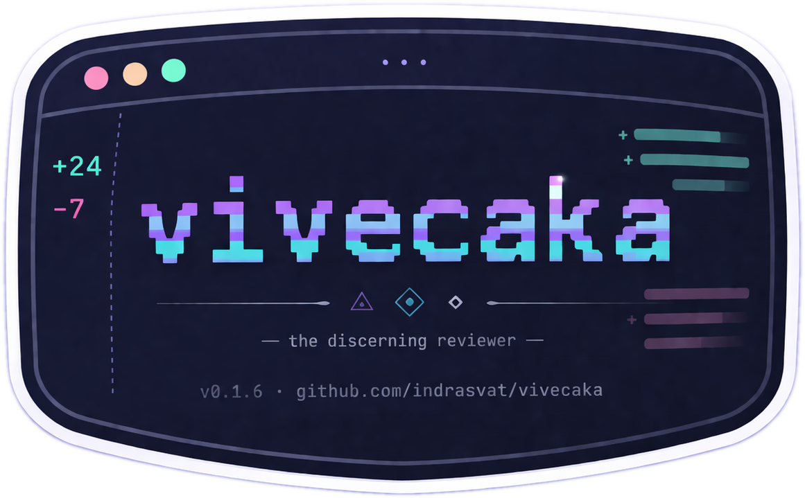
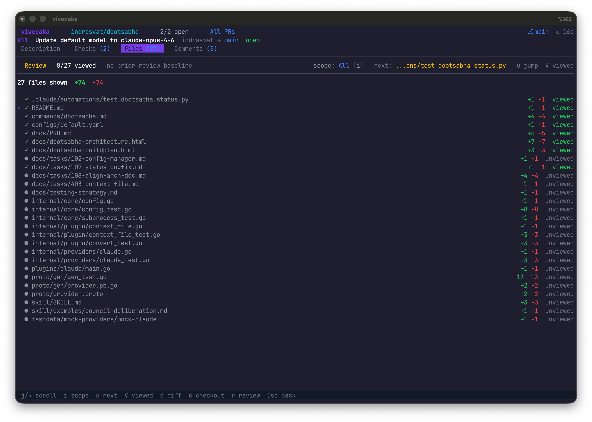
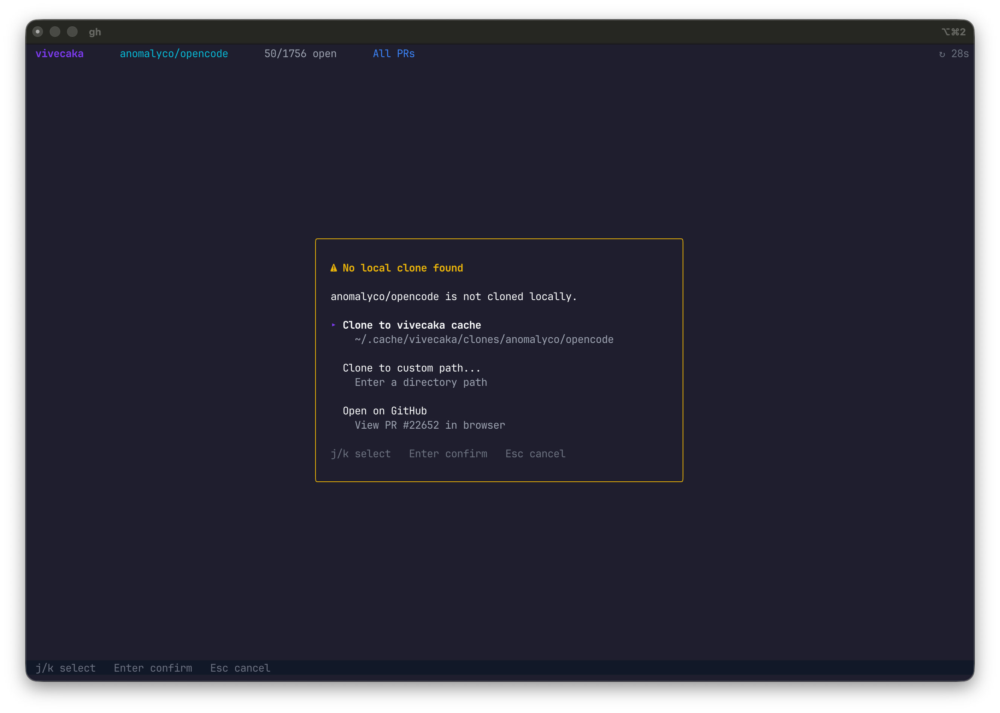
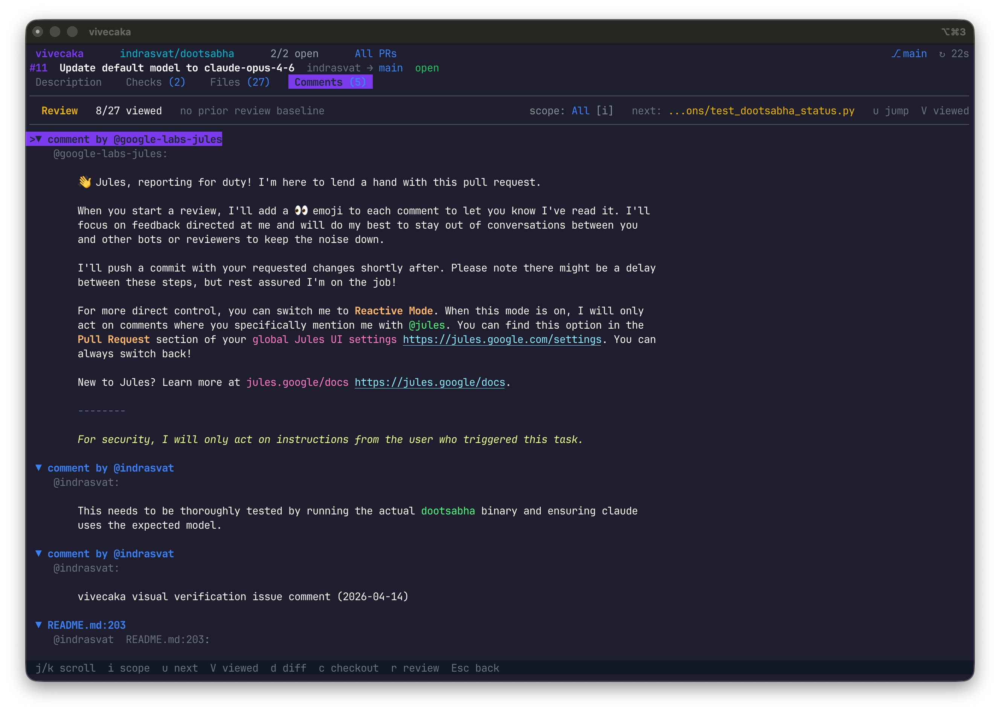
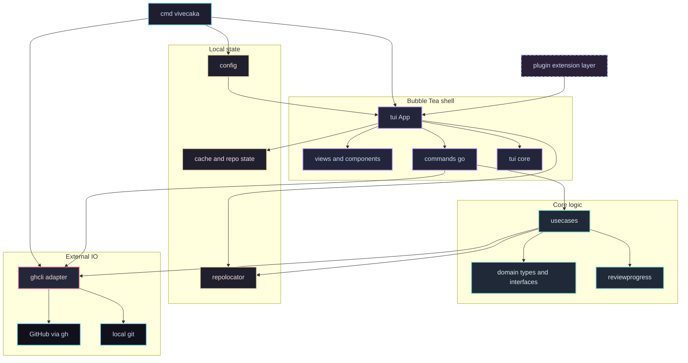

<p align="center">
  <br>
  <strong>Keyboard-First GitHub PR Review</strong><br>
  <em>The discerning reviewer for people who live in the terminal.</em><br>
  <code>vivecaka</code> (विवेचक) means “one who examines.”
</p>

<p align="center">
  <a href="#overview">Overview</a> •
  <a href="#why-vivecaka">Why vivecaka</a> •
  <a href="#feature-spotlights">Feature Spotlights</a> •
  <a href="#install">Install</a> •
  <a href="#quick-start">Quick Start</a> •
  <a href="#controls">Controls</a> •
  <a href="#configuration">Configuration</a> •
  <a href="#development">Development</a> •
  <a href="#architecture">Architecture</a>
</p>

---

## Overview

`vivecaka` keeps PR triage, detail, diffing, review context, and checkout in one fast TUI, so follow-up review stops feeling like tab archaeology.

It is built for the annoying part of code review: reopening a PR after new commits land, figuring out what changed since your last pass, and getting back to the next actionable file without re-reading everything.

<p align="center">
  
</p>

## Why vivecaka

Most PR tools handle first-pass review well enough. The pain starts when a PR comes back with new commits, fresh comments, and a diff you have already partially seen.

`vivecaka` is built for that moment:

- **Repeat review without re-reviewing everything**: cycle `All`, `Since Visit`, `Since Review`, and `Unviewed`, then jump straight to the next actionable file.
- **Stay in the terminal**: triage, open detail, inspect files, read comments, diff in unified or split mode, and checkout the branch without bouncing through browser tabs.
- **Works on noisy real repos**: the demo above runs against `anomalyco/opencode`, and the same flow works cleanly on smaller personal repos like `indrasvat/dootsabha`.

## Feature Spotlights

### 1. Incremental review that remembers where you were

`vivecaka` persists per-file viewed state and review baselines, so reopening a PR answers the questions reviewers actually care about:

- What changed since I last looked?
- What changed since I last submitted a review?
- Which file should I jump to next?

<p align="center">
  
</p>

The review context bar is compact but useful: progress, active scope, next target, and per-file viewed state are all visible. `i` cycles scope, `u` jumps forward, and `V` toggles viewed state at the current head revision.

### 2. Smart cloning and checkout without leaving the TUI

When the PR you are reviewing is not the repo under your current shell, `vivecaka` does not force you into manual `git clone` housekeeping. Smart checkout can reuse the current repo, reuse a known local clone, or guide you through cloning before checking out the PR branch.

<p align="center">
  
</p>

This matters because PR review often turns into local validation. The app keeps that transition tight: inspect the PR, decide you need local context, press `c`, and keep moving.

### 3. Rich comments and discussion in the same review surface

The comments view is not an afterthought. Inline threads and timeline discussion stay in the same terminal workflow, so review context, review history, and file state do not get split across browser tabs.

<p align="center">
  
</p>

That makes follow-up review less lossy: you can read prior feedback, inspect the current diff, and continue the review from the same place.

### 4. A terminal-native PR workflow, not just a list view

The `anomalyco/opencode` demo above is the core experience:

- open a live queue from any repo with `vivecaka --repo owner/name`
- inspect PR detail without leaving the keyboard
- jump into the files tab and diff viewer immediately
- switch unified and split diff layouts on demand
- checkout the branch with `c` when you need local context

This is where `vivecaka` shines: browser-grade awareness, terminal-grade flow.

## Install

### Installer script

```bash
curl -sSfL https://raw.githubusercontent.com/indrasvat/vivecaka/main/install.sh | bash
```

Installs the latest release to `~/.local/bin`.

```bash
# Install a specific version
curl -sSfL https://raw.githubusercontent.com/indrasvat/vivecaka/main/install.sh | \
  bash -s -- --version v0.1.6

# Install to a custom directory
curl -sSfL https://raw.githubusercontent.com/indrasvat/vivecaka/main/install.sh | \
  bash -s -- --dir /usr/local/bin
```

The release installer currently targets macOS on Apple Silicon and Intel.

### From source

```bash
go install github.com/indrasvat/vivecaka/cmd/vivecaka@latest

git clone https://github.com/indrasvat/vivecaka.git
cd vivecaka
make build
./bin/vivecaka
```

## Quick Start

### Requirements

- Go `1.26+` if building from source
- [GitHub CLI](https://cli.github.com/) (`gh`) installed and authenticated

### Launch modes

```bash
# Launch inside the current GitHub repo
vivecaka

# Launch against any repo
vivecaka --repo anomalyco/opencode

# Persist a repo override in the shell
VIVECAKA_REPO=indrasvat/dootsabha vivecaka

# Inspect flags and env vars
vivecaka --help
```

### What to try first

1. Launch `vivecaka --repo anomalyco/opencode`
2. Press `Enter` on the first PR
3. Press `3` for the files tab
4. Press `d` for diff view
5. Press `t` to toggle split mode
6. Press `i` to cycle incremental review scope

## Controls

### PR list

| Key | Action |
|-----|--------|
| `j` / `k` | Move cursor |
| `Enter` | Open PR detail |
| `/` | Search |
| `f` | Open filter panel |
| `I` | Open unified inbox |
| `R` | Switch repo |
| `T` | Cycle theme |
| `q` | Quit |

### PR detail and diff

| Key | Action |
|-----|--------|
| `1`-`4` | Switch detail tabs |
| `d` | Open diff view |
| `c` | Checkout branch |
| `r` | Submit review |
| `i` | Cycle `All` -> `Since Visit` -> `Since Review` -> `Unviewed` |
| `u` | Jump to next actionable review target |
| `V` | Toggle viewed state for the current file |
| `t` | Toggle unified / split diff |
| `[` / `]` | Previous / next hunk |
| `{` / `}` | Previous / next file |
| `Esc` | Back |

## Configuration

Config lives at `~/.config/vivecaka/config.toml` and is auto-created on first run.

```toml
[general]
theme = "default-dark"
refresh_interval = 30
page_size = 50

[diff]
mode = "unified"
external_tool = ""

[repos]
favorites = ["indrasvat/dootsabha", "anomalyco/opencode"]
```

## Development

```bash
make build         # Build binary -> bin/vivecaka
make test          # Tests with -race
make lint          # golangci-lint
make ci            # fmt -> vet -> lint -> govulncheck -> test -> build
make demo          # Render assets/demo.gif with VHS
```

## Architecture

`vivecaka` is easiest to reason about as one interactive shell plus three side systems:

- `internal/tui` owns the Bubble Tea event loop, view routing, overlays, and session state.
- `internal/usecase` owns review workflows and calls the adapter strictly through `internal/domain` interfaces.
- `internal/adapter/ghcli` is the shipped I/O boundary for GitHub and local git operations.
- `internal/config`, `internal/cache`, `internal/repolocator`, and `internal/reviewprogress` provide config, persistence, repo discovery, and incremental review derivation.



Practical reading order:

1. `cmd/vivecaka/*.go` for startup, flags, env vars, and dependency injection.
2. `internal/tui/app.go` plus `internal/tui/commands.go` for the real runtime control flow.
3. `internal/usecase/*.go` for business behavior boundaries.
4. `internal/adapter/ghcli/*.go` for all `gh` and `git` side effects.
5. `internal/cache/state.go`, `internal/reviewprogress/`, and `internal/repolocator/` for the sticky behaviors that make incremental review and smart checkout feel stateful.

Accuracy notes:

- The plugin package is deliberately shown as a dashed future-facing surface. It exists and `ghcli.Adapter` satisfies the plugin interface, but the current app still wires `ghcli.New()` directly into `tui.New(...)`.
- `internal/reviewprogress` is derived logic, not storage. Persistence lives in `internal/cache/state.go`; `reviewprogress` computes actionable files and scopes from the current diff plus stored baselines.
- `internal/tui/commands.go` is mostly a use-case launcher, but it also contains a few direct `ghcli` utility calls for repo/user discovery and validation, so the runtime is not purely `tui -> usecase -> adapter` at every edge.

## License

MIT — see [LICENSE](LICENSE)
